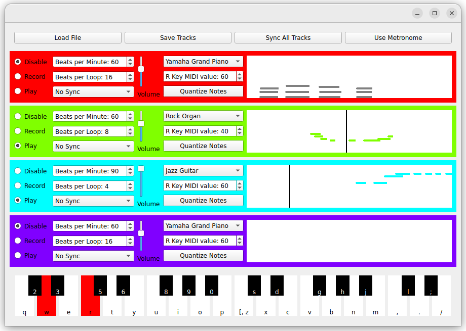

# Loop Station #
Mia Jane La Rocca \
Computer Science Exercises

## Set Up Instructions ##
The code was developed and tested on a laptop running Ubuntu 22.04.5 LTS. I have not tried it on other systems.

1. Clone repository
2. Download fluidysnth data from https://drive.google.com/file/d/1Axjm6w5kpsndNDWwNcLB6aCwnaQxX_rM/view?usp=sharing so that the file structure looks like this.
```
loop_station
├── clock.py
├── data
│   ├── FluidR3_GM.sf2
│   └── fluid_synth_programs.txt
├── documentation
│   ├── block_diagram.drawio
│   ├── block_diagram.png
│   ├── final_gui.png
│   ├── gui_mockup.png
│   ├── looper_mockup.png
│   ├── mlarocca_final_report.pdf
│   ├── mlarocca_progress_report.pdf
│   └── progress_report_gui.png
├── first_track.txt
├── looper.py
├── main.py
├── README.md
├── requirements.txt
└── synth_wrapper.py
```
3. Install fluidsynth
```
sudo apt install fluidsynth
```
4. Create and activate environment with Python 3.7 (replace path to your python 3.7)
```
virtualenv --python="/usr/bin/python3.7" ./station_venv
source station_venv/bin/activate
```
5. Install other requirements
```
pip install -r requirements.txt
```

## Operating Instructions ##
1. Activate your environment
2. Launch program with your desired number of tracks
```
python main.py [NUMBER OF TRACKS]
```
### GUI Explanation ###


**Load File:** Loads tracks from yaml file. Currently there is no failsafe to ensure the file is the correct format so be careful.

**Save File:** Saves tracks to yaml file.

**Sync All Tracks:** Synchronizes start times of all tracks.

**Use Metronome:** Will play a metronome when you are recording to a track. Currently if you record more than one track at a time, it will only play for the latest track you hit record on.

#### Looper GUIs ####

Controls are explained left to right, top to bottom.

**Mode Buttons:** The Disable, Record and Play buttons on the left side of the GUI are used to set the mode of each track. In disable mode, the track is off. In the record mode, the user can record notes by playing on the keyboard using the keys shown at the bottom of the GUI. In Play mode, the track plays the recorded sounds.

**Beats per Minute:** sets beats per minute of the track

**Beats per Loop:** sets the beats per loop of the track

**Sync:** can sync this track to another track. Syncing a track sets the beats per minute, beats per loop, and start time equal to the other track.

**Volume:** sets the volume of the track

**Instrument:** sets the instrument of the track

**R Key MIDI value:** sets the MIDI value of the R key. This will transcribe the track up or down if it is changed after the track has been recorded.

**Quantize Notes:** when selected, notes that are recorded will be quantized to the nearest 12th of a beat.

